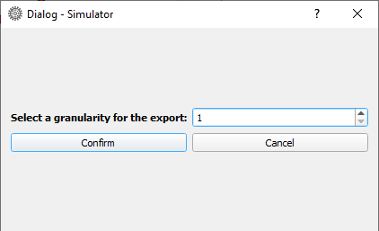
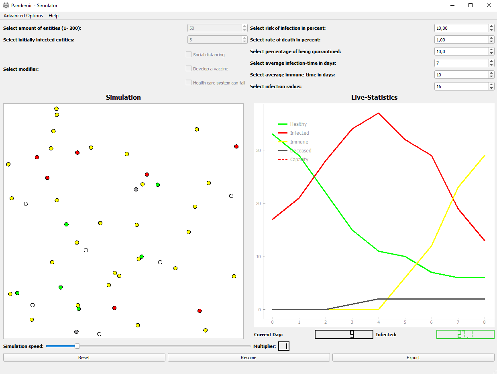
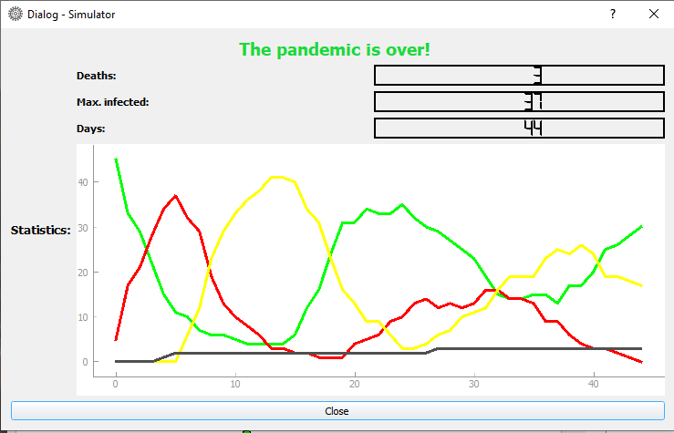

# Pandemic simulator
The program can simulate the progression of a disease over time within a community, which is represented by a set
of particles. The simulation can be modified and parameters can be changed to look at different scenarios and therefore
different results. The data, e.g. the number over diseased people over time, is visualized by a graph and updated every
second.
## Instruction
Interaction with the simulation can be made with buttons and with interchangeable parameters. The most notable buttons
are:<ul>Start/Reset  <li> Pause/Resume  <li> Export <li> Reset parameters </ul> A click on the start button
will start the simulation, the button will then change to a "Reset-Button" to reset the simulation to the point before
starting. Also, after starting the simulation, the "Pause" and "Export"-buttons are revealed. "Pause" will stop the
simulation and reveal the "Resume"-button, which is used to continue the simulation. The export button opens an
second dialog window, which will ask you to set a granularity for the export: 
   
With "Reset parameters", all parameters get a reset to their respective default value. The parameters are<ul>Amount of
entities <li>Initially infected entities <li>Risk of infection <li>Rate of death <li>Percentage of being
quarantined <li>Average infection time <li>Average immune time <li>Infection radius <li>Speed of 
simulation</ul> Every parameter is changeable during the simulation, except for "Amount of entities" and initially
infected. The three modifiers are <ul>Social distancing <li>Develop a vaccine <li>Health care system can 
fail</ul>"Social distancing" prohibits the particles to come to close to each other, the radius is changeable via 
a drop down spinbox (however, not all people are to keen on keeping distance to another!).  "Develop a vaccine" 
will reveal a drop down spinbox to select the number of days needed to develop a vaccine, that will partially vaccinate
up to 5% of the population a day (each second).  "Health care system can fail" lets the user select a capacity
and a multiplier, the capacity is a ceiling of infected particles, if the capacity gets overrun, the death rate
increases by the selected multiplier to the original selected value, as treatment is not available for everybody 
During the simulation, the GUI will look like this: 
  
At the menu bar, there are also selectable advanced options, where the user can toggle the visibility of the infection
radius and the social distancing radius. The "help"-dropdown in the menu bar gives information about the max and min
values of the changeable parameters and "legend", that is information about the color to the corresponding state of a
particle. 
After either all particles have died or no particle is left infected, a "stat-window" pops up that summarizes the
course of the pandemic and the simulation gets paused: 
  
This window can be closed via the "close" button, but there are still all options available for the simulation (resume,
restart or export).
## Built with
<ul>
Python <li>PyQt5 <li>pyqtGraph <li>NumPy
</ul>

## Author
<em><li>Jonas Adler, University of Bayreuth</em>

